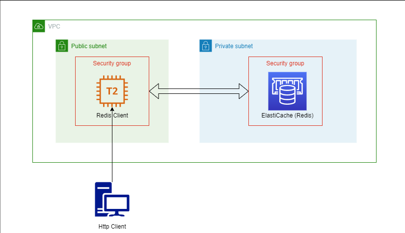

# Spring Boot (RESTful) client for AWS ElastiCache (Redis Data Store)

> Team Members: Shubham Shingate, Nirja Shah

> Technologies Used: Java 1.8, Sprin Boot, AWS ElastiCache, EC2, IAM, Security Groups

> Problem Statement: To implement a Java Spring Boot client for Redis Data Store.

## Client service to consume from a Redis Data Store 
Here I implemented a client service using spring boot to interact with a Redis Data Store running on AWS ElastiCache. The client service is simply deployed on an EC2 instance which exposes a public DNS hostname.

